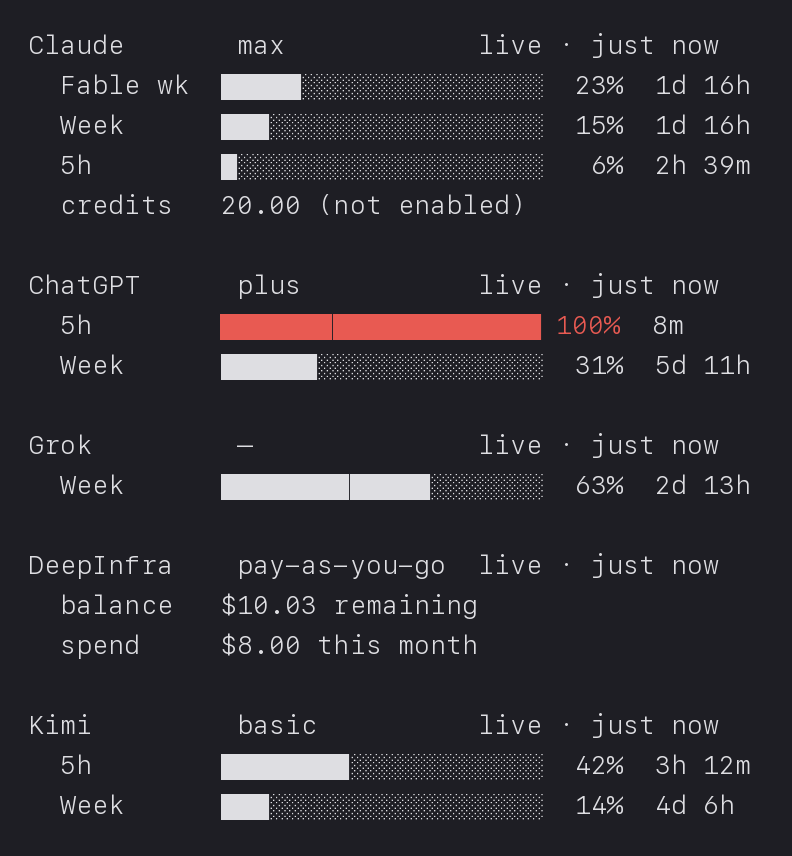
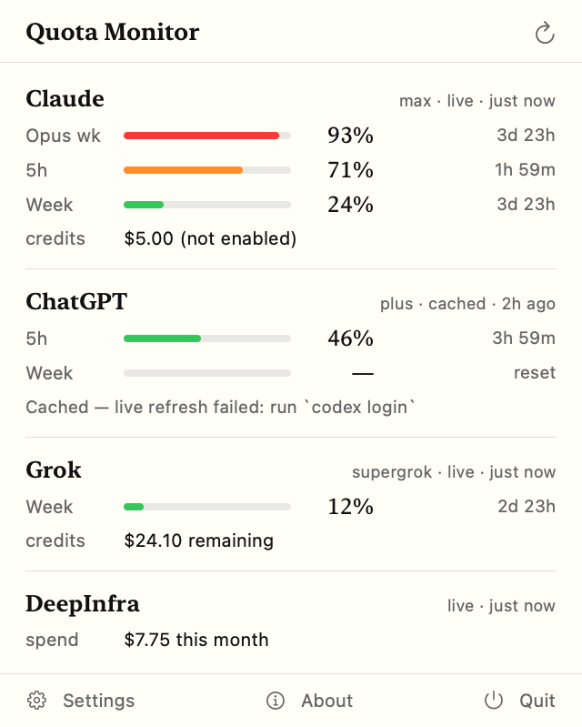

# Quota Monitor

See how much of your LLM subscription quota you have left across every
provider at once — in the terminal, the macOS menu bar, or a Waybar module.
It reads your **Claude** (Anthropic), **ChatGPT** (Codex), **Grok** (xAI),
**DeepInfra**, and **Kimi** (Moonshot) accounts and shows one normalised view
so you can tell, at a glance, which provider you are about to hit the ceiling
on.

<p align="center">
  
  &nbsp;&nbsp;
  
</p>

<sub>Left: `quotamon` in the terminal. Right: the macOS menu-bar panel. Both
render sample data; your own numbers stay on your machine.</sub>

The heavy lifting lives in [`core/`](core/README.md), a single static Go
binary called **`quotamon`**. Everything above the normalised snapshot — the
macOS app, the widget, the Waybar module — is a dumb renderer of it.

## Quick start

Build the binary, then let it discover your accounts:

```bash
cd core && make build
./bin/quotamon setup      # first run: discovers accounts, writes config
```

`setup` probes for local credentials and shows what it found before asking
which providers to enable:

```text
Looking for providers…
✓ Claude      Keychain item present
✓ ChatGPT     ~/.codex/auth.json
✗ Grok        not signed in — run `grok login`
✗ DeepInfra   no API key
· Kimi        credentials found, but Kimi exposes no quota API yet

Enable Claude? [Y/n]
Enable ChatGPT? [Y/n]
Enable Grok? [y/N]
Enable DeepInfra? [y/N]
DeepInfra API key (input hidden is not available; paste and press Enter):
Wrote /Users/you/.config/quotamon/config.json (mode 0600). Run: quotamon
```

Then just run it:

```bash
./bin/quotamon
```

```text
Claude          max    live · just now
  5h               43%  resets in 2h 11m
  Week             20%  resets in 4d 23h
  credits        20.00 (not enabled)
ChatGPT         plus   cached · 3m ago
  Week             18%  resets in 6d 7h
Grok            —      live · just now
  Week             63%  resets in 4d 6h
DeepInfra       pay-as-you-go live · just now
  credits       $7.75 this month
```

Configuration lives in one JSON file (see the path precedence in
[`core/README.md`](core/README.md#configuration)). API keys may live in that
file, but the file is always written with mode **0600**, and a config carrying
an `api_key` with looser permissions is refused — fix it with
`chmod 600 <path>`.

The other commands:

```bash
./bin/quotamon --json     # normalized snapshot as JSON (alias for `snapshot`)
./bin/quotamon waybar     # one line of Waybar custom-module JSON
./bin/quotamon check      # probe every source independently
./bin/quotamon providers  # which providers are enabled
```

Cross-compile for all supported platforms in one shot:

```bash
make matrix               # darwin/arm64, linux/amd64, linux/arm64
```

## Omarchy / Waybar

`quotamon` ships a Waybar custom module. Add this to your Waybar config:

```json
"custom/quota": { "exec": "quotamon waybar", "return-type": "json",
                  "interval": 300 }
```

The module emits `text`, `tooltip`, `class`, and `percentage`. Style it with
`#custom-quota` in your Waybar CSS; the class is `normal` below 70%,
`warning` below 90%, `critical` above that, and `unavailable` when no provider
has a current reading, so you can colour each state. `interval` is in seconds
(here, five minutes); `quotamon` runs a fresh fetch on every call, so keep it
coarse enough for your machine.

## Where the numbers come from

No vendor publishes a subscription-quota API, so each provider is read
from wherever its CLI keeps state. Details, endpoints and gotchas for every
provider are in [`PROVIDERS.md`](PROVIDERS.md).

| Provider | Credential | Route | Status |
|---|---|---|---|
| Claude | Claude Code OAuth via the `security` CLI (Keychain) | `api.anthropic.com/api/oauth/usage` | ✅ live |
| ChatGPT / Codex | handled by the vendor CLI, no token touched | `codex app-server` JSON-RPC (`account/rateLimits/read`) | ✅ live |
| Grok | bearer token in `~/.grok/auth.json` | `cli-chat-proxy.grok.com/v1/billing?format=credits` | ✅ live |
| DeepInfra | `DEEPINFRA_KEY` (env or config) | `api.deepinfra.com/payment/*` | ✅ live — prepaid balance + spend, no quota |
| Kimi | token in `~/.kimi-code/credentials/kimi-code.json` | `api.kimi.com/coding/v1/usages` | ✅ live — weekly + 5h windows |
| Replicate | — | API token exposes no spend; balance is browser-cookie-only | ✖ excluded (see [PROVIDERS.md](PROVIDERS.md)) |

Each provider has up to **two** sources, and the tool prefers whichever is
fresher *and* trustworthy. The **live** source talks to the account and is
current, but rides undocumented endpoints. The **local** source reads a file a
vendor CLI has already written (Claude's statusline mirror, Codex's session
rollouts); it costs nothing and touches no tokens, but is only as fresh as
your last CLI turn.

That freshness matters: a quota window that has **reset** since it was
recorded shows **`—`**, never `0%`. Returning `0%` there would claim a fresh,
empty window the tool has no evidence for, and would read as "plenty left"
when the truth is "we don't know yet". So Live wins when it succeeds;
otherwise the cached reading is shown *and* labelled with why it is stale.

## Principles

- **Absence is never zero.** A reset or missing window renders `—`, never a
  zero the user could misread as "plenty left".
- **Credentials are addressed by path, never searched for.** Claude's Keychain
  item and Grok's auth file both hold several services' tokens side by side; a
  recursive "find an access token" finds the wrong one. A silent-key bug
  shipped once already, so every credential is taken from an explicit,
  deterministic path.
- **Stale readings are corrected, not trusted.** A recording past its
  `resetsAt` reports no current reading.
- **Identify honestly.** No spoofed User-Agents, no cookies lifted from a
  browser, no bot-protection workarounds. Where a vendor ships a local CLI
  (`security`, `codex app-server`), use it over its private HTTP API.

The sparkline / pace design you may have seen in older versions of this
project belonged to an earlier macOS design. It answered
"compared to what?" by drawing each window across its full span against a
diagonal of even consumption — a number becomes a decision. That reasoning
still stands; the current app keeps a simpler bar per window.

## macOS app & widget

A SwiftUI menu-bar app (pictured above) shows the same table as the console,
with a **Refresh** button, and a first-run setup pane so you never need the
terminal. Build it:

<p align="left"></p>

<sub>The status-bar icon stacks one usage bar per provider (tightest window,
coloured by severity) into a single glyph.</sub>

```bash
brew install xcodegen
./scripts/build.sh          # generates the project, builds, bundles quotamon
```

The app bundles the `quotamon` binary in `Contents/Resources/`, runs it on the
refresh interval (and on demand from the button), and ingests the snapshot
JSON. **First run:** if no config exists, the app shows a setup pane that
discovers your providers and writes the config for you — the GUI equivalent of
`quotamon setup`. The **widget** reads the shared snapshot only (it never
execs); it needs an App Group, which needs a signing team — see
[`Config/Signing.xcconfig`](Config/Signing.xcconfig). The menu-bar app works
fully without one.

Regenerate the screenshots in this README with `scripts/screenshots.sh`
(sample data only).

## Layout

```
core/                portable Go core — the snapshot contract and every source
  cmd/quotamon/      the CLI (table, --json/snapshot, waybar, check, setup)
  internal/providers/ per-provider sources (claude, codex, grok, deepinfra)
QuotaKit/            macOS app core — Swift models, sources, engine (frozen)
  Sources/quotactl/  diagnostic CLI (the parity reference)
App/                 SwiftUI menu-bar app (table, force refresh, setup pane)
Widget/              WidgetKit extension (reads the shared snapshot)
docs/                README screenshots (regenerate: scripts/screenshots.sh)
scripts/             build.sh, screenshots.sh, the Claude statusline mirror
```

## Troubleshooting

`quotamon check` probes every source independently, so a wrong number can be
traced to its origin. Each line reports a source and an error *kind*:

| Kind | Meaning | What to do |
|---|---|---|
| `notConfigured` | an optional source wasn't set up, or no credential found | enable the source, or sign in (e.g. `claude`, `codex login`, `grok login`) |
| `unauthorized` | the credential was rejected | sign in again; the message says which provider |
| `transport` | a network or endpoint hiccup | try again — a retry may succeed, or the endpoint moved |
| `malformed` | the response couldn't be parsed | probably endpoint drift; an update will address it |
| `noDataFound` | a configured source contained no usable reading | run the vendor CLI once so a local rollout exists |
| `skipped (--no-live)` | a live-only source was not probed | expected under `--no-live` |

Two notes:

- **Claude reads its credential via the `security` CLI, never the framework
  API.** The framework API either refuses an unsigned binary or pops an
  interactive "allow access?" dialog, which a console tool must never block
  on. The `security` CLI returns the item silently.
- **ChatGPT reports usage only after a Codex turn.** If every Codex window has
  reset since your last turn, the tool says so plainly ("…only after a Codex
  turn — last reading 3m ago") rather than implying an outage.

## Contributing / for agents

- [`AGENTS.md`](AGENTS.md) — how to work here (layout, conventions, commands, gotchas).
- [`PROVIDERS.md`](PROVIDERS.md) — the provider contract: endpoints, credentials, dead ends.
- [`GO-PORT.md`](GO-PORT.md) — the design record and status of the Go core port.
